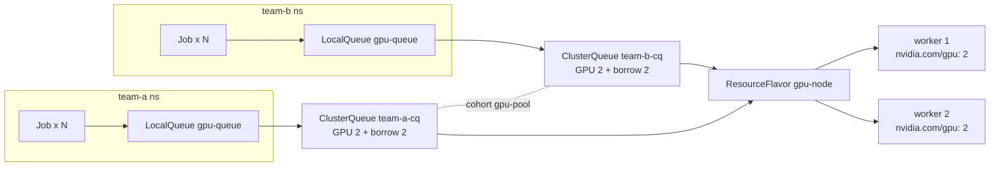
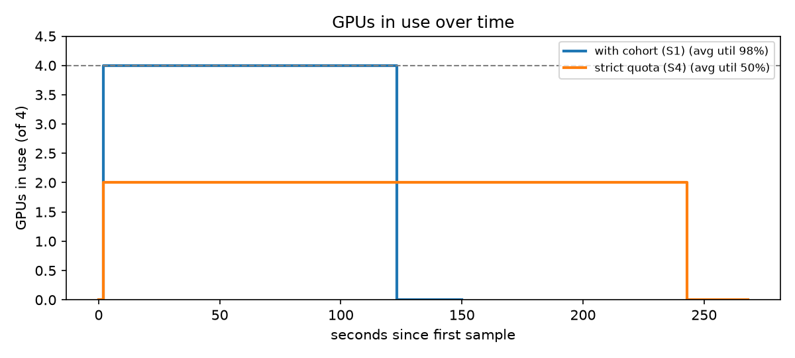

# GPU Queue Lab — 쿠버네티스 GPU 작업 스케줄링

> 여러 팀이 한정된 GPU를 **줄 서서, 공정하게, 놀리지 않고** 나눠 쓰게 만드는 쿠버네티스 배치 스케줄링 실험 환경입니다.
> [KubeLLM-Ops](https://app.notion.com/p/3e746d96621a8170b6c6f5e04b0ccfc4)가 "추론 서비스 운영"이라면, 이 프로젝트는 "학습·배치 작업의 GPU 자원 관리"를 다룹니다.

## 왜 이 문제인가

GPU는 비싸고 적습니다. 팀마다 GPU를 고정으로 나눠 주면 한 팀이 쉬는 동안 GPU가 놀고, 다 같이 쓰게 하면 한 팀이 독점합니다.
이 프로젝트는 [Kueue](https://kueue.sigs.k8s.io/)로 다음을 구현하고 숫자로 검증합니다.

| 요구사항 | 구현 |
|---|---|
| 팀별 GPU 할당량 | ClusterQueue `nominalQuota` |
| 쉬는 팀의 GPU는 빌려 쓰기 | 같은 `cohortName` + `borrowingLimit` |
| 주인이 돌아오면 되찾기 | `preemption.reclaimWithinCohort: Any` |
| 급한 작업 먼저 | WorkloadPriorityClass + `withinClusterQueue: LowerPriority` |
| 할당량 넘는 작업은 대기 | Job `suspend` → Kueue가 자리 날 때 실행 |

## 구성



- **클러스터**: kind (control-plane 1 + worker 2)
- **GPU**: 1단계는 노드에 가짜 `nvidia.com/gpu` 용량을 등록해서 GPU 없는 노트북에서도 실험. 쿠버네티스와 Kueue 입장에서는 진짜 GPU와 똑같이 스케줄링됩니다. 2단계에서 RTX 4060 + time-slicing으로 실제 검증 ([docs/real-gpu.md](docs/real-gpu.md))
- **스케줄러**: Kueue v0.20.0 (API `kueue.x-k8s.io/v1beta2`)
- **도구** `gpuq` (Python 표준 라이브러리만 사용): 작업 일괄 제출, 대기시간·선점 리포트, GPU 사용률 샘플링

## 실행

필요: Docker Desktop, kind, kubectl, Python 3.10+ (스크립트가 막히면 먼저 `Set-ExecutionPolicy -Scope Process Bypass`)

```powershell
scripts/00-create-cluster.ps1
scripts/01-fake-gpu.ps1          # 워커당 GPU 2개 등록
scripts/02-install-kueue.ps1
scripts/03-apply-queues.ps1

python -m gpuq submit --team team-a --count 4 --duration 300
kubectl get workloads -A
python -m gpuq report
```

실험 시나리오(S1 빌려 쓰기, S2 돌려받기, S3 우선순위 선점, S4 비교)는 [docs/experiments.md](docs/experiments.md)에 있습니다.
각 시나리오 후 `scripts/capture.ps1 -Name s1`이 `evidence/s1/`에 증거를 저장합니다.

## 시뮬레이션 모드 (KWOK, Linux / WSL2)

Docker 안에 노드를 못 띄우는 환경(CI, 클라우드 샌드박스)에서도 같은 실험을 돌리는 방법입니다.

- 진짜 kube-apiserver, kube-scheduler, controller-manager와 **진짜 Kueue v0.20.0 컨트롤러**를 띄우고, kubelet 대신 [KWOK](https://kwok.sigs.k8s.io/)가 가짜 노드 2대(각 GPU 2개)를 흉내 냅니다.
- 그래서 **어떤 작업을 언제 받아 주고 누구를 선점할지는 실제 Kueue의 판단**이고, 컨테이너 실행만 시뮬레이션입니다. Pod는 `--duration`만큼 Running으로 있다가 끝납니다 ([kwok/stages.yaml](kwok/stages.yaml)).

```bash
sim/up.sh                 # kwokctl, kueue 바이너리 받고 클러스터 + 큐 구성
export KUBECONFIG=/tmp/gpuq-sim/kubeconfig
sim/run-all.sh            # S1~S4 자동 실행, evidence/sim/에 결과 저장 (약 14분)
sim/down.sh
```

## 테스트

```powershell
python -m unittest discover -s tests -v
```

`tests/fixtures/workloads.json`은 Kueue Workload 형식에 맞춰 손으로 만든 예시입니다. 실제 클러스터에서 S2를 돌린 뒤 `evidence/s2/workloads.json`으로 교체하면 더 좋습니다.

## 결과 (시뮬레이션 모드)

| 지표 | 빌려 쓰기 있음 | 엄격한 할당량 |
|---|---|---|
| 작업 4개 완료 시간 | **121초** | 243초 |
| 평균 GPU 사용률 | **98%** | 50% |
| 주인 팀 GPU 회수 시간 (선점) | **1~2초** | - |
| high 작업 대기시간 (선점) | **1초** | - |



자세한 내용과 원본 증거: [evidence/sim/RESULTS.md](evidence/sim/RESULTS.md)

Windows kind 클러스터(진짜 kubelet, 가짜 GPU)에서도 같은 결과가 나왔습니다: 완료 124초 vs 250초, 사용률 98% vs 50% ([evidence/kind/RESULTS.md](evidence/kind/RESULTS.md)).

## 진행 상황

| 단계 | 상태 |
|---|---|
| Kueue 매니페스트 작성 + v0.20.0 CRD 스키마 검증 | ✅ 완료 |
| `gpuq` 제출/리포트 도구 + 단위 테스트 | ✅ 완료 |
| S1~S4 실험 (KWOK 시뮬레이션, 실제 Kueue 컨트롤러) | ✅ VERIFIED |
| kind 클러스터 + 가짜 GPU 등록, S1~S4 재현 (Windows) | ✅ VERIFIED ([결과](evidence/kind/RESULTS.md)) |
| 실제 GPU time-slicing (RTX 4060, k3s on WSL2) | ✅ VERIFIED ([결과](evidence/real-gpu/RESULTS.md)) |

> 실제로 돌려서 확인한 항목만 완료로 바꿉니다.
