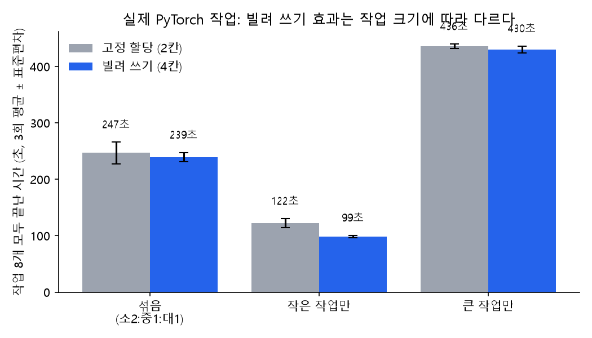
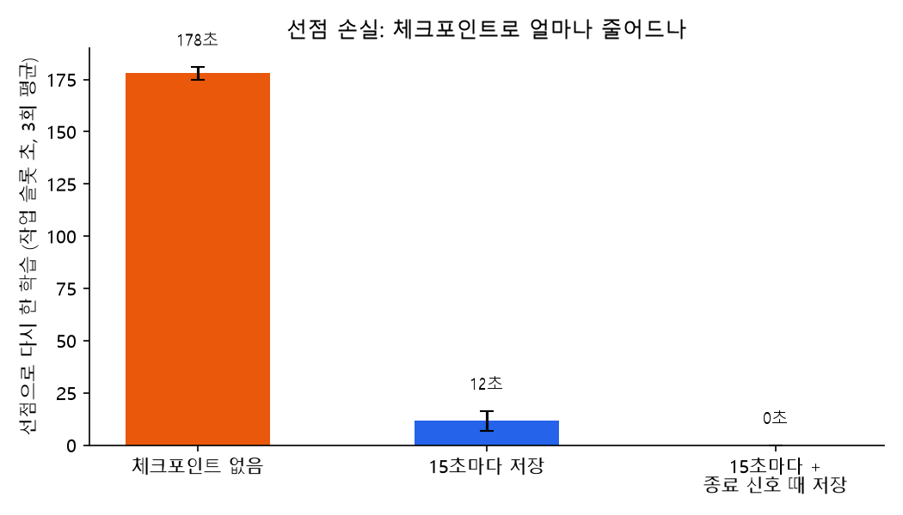

# 실제 GPU v2 결과: 진짜 학습 작업, 3회 반복 (2026-10-02)

v1의 약점(작업이 `sleep`, 가짜 GPU, 한 번씩만 측정, 선점 손실 해결 안 함)을 보완한 실험입니다.

환경: Windows 11 + WSL2 Ubuntu 24.04, RTX 4060 8GB (드라이버 616.92), k3s v1.36.4, NVIDIA device plugin v0.17.1
time-slicing `replicas: 4` (GPU 1장 = `nvidia.com/gpu` 4칸), Kueue v0.20.0, 이미지 `pytorch/pytorch:2.4.0-cuda12.1-cudnn9-runtime`.
team-a, team-b가 각각 2칸 소유. 측정 중 Windows 쪽 GPU 사용 프로그램은 껐습니다.

작업: [`tools/train_job.py`](../../tools/train_job.py), 크기 3종의 CNN 학습(가짜 데이터, 다운로드 없음). 각각 GPU 단독으로 약 45초.

| 크기 | 채널 / 배치 | 특징 |
|---|---|---|
| small | 16 / 32 | 커널이 작아 GPU를 다 못 씀 (커널 실행 대기가 병목) |
| medium | 32 / 128 | 중간 |
| large | 64 / 256 | 혼자서 GPU 100% |

재현: `scripts/wsl/install-k3s-gpu.sh`(sudo, 1회) → `scripts/wsl/setup-v2.sh` → `scripts/wsl/run-v2.sh mix`, `scripts/wsl/run-v2.sh ckpt` → `python tools/v2_aggregate.py`.
반복은 A B A B 순서로 섞어서 돌렸습니다(시간에 따른 기기 상태 변화가 한쪽에 몰리지 않게). 표의 값은 **3회 평균 ± 표준편차**입니다.

## 1. 빌려 쓰기 vs 고정 할당 (실제 학습 작업 8개)

team-a 혼자 작업 8개를 한꺼번에 넣습니다. 고정 할당은 자기 2칸만, 빌려 쓰기는 쉬고 있는 team-b 2칸까지 4칸을 씁니다.

| 작업 구성 | 할당 | 8개 모두 끝난 시간 | 작업당 평균 완료 시간 | 평균 대기 | GPU 사용률 |
|---|---|---|---|---|---|
| 섞음 (small 4, medium 2, large 2) | 고정 2칸 | 246.8초 ± 19.3 | 149.1초 ± 13.2 | 96.1초 ± 9.3 | 93.1% ± 3.0 |
| | 빌려 쓰기 4칸 | 239.4초 ± 8.1 (**-3%**, 오차 안) | 167.4초 ± 17.4 | 60.7초 ± 5.7 | 98.0% ± 0.4 |
| small만 8개 | 고정 2칸 | 122.2초 ± 8.1 | 74.9초 ± 5.8 | 50.4초 ± 4.3 | 72.6% ± 2.2 |
| | 빌려 쓰기 4칸 | 98.5초 ± 2.0 (**-19%**) | 71.2초 ± 0.8 | 28.2초 ± 0.1 | 85.4% ± 0.2 |
| large만 8개 | 고정 2칸 | 436.2초 ± 3.8 | 269.9초 ± 2.7 | 167.4초 ± 1.7 | 94.7% ± 0.3 |
| | 빌려 쓰기 4칸 | 430.3초 ± 5.9 (**-1%**) | 321.0초 ± 3.6 (**+19%**) | 111.5초 ± 0.7 | 97.7% ± 0.2 |

### 해석

- 가짜 GPU(v1)에서는 빌려 쓰기로 완료 시간이 **절반**이 됐지만, 실제 GPU 1장을 4칸으로 나눈 환경에서는 **작업이 GPU를 얼마나 쓰느냐에 따라 효과가 0~19%** 였습니다.
  빌린 2칸이 진짜 GPU가 아니라 **같은 GPU의 시간 조각**이기 때문입니다.
- **small 작업**은 혼자서 GPU를 73%밖에 못 채웁니다. 4개를 겹치면 빈 시간을 서로 메워 사용률이 85%로 오르고 완료 시간이 19% 줄었습니다. 빌려 쓰기가 진짜 이득인 경우입니다.
- **large 작업**은 2개만 돌려도 GPU가 95%로 꽉 찹니다. 4칸으로 늘려도 전체 완료 시간은 그대로이고, 작업 하나하나는 서로 GPU를 나눠 갖느라 **19% 늦게** 끝났습니다(대기는 줄고 실행은 길어짐).
- 결론: 노드에 진짜 GPU가 여러 장이면 빌려 쓰기는 v1처럼 그대로 이득이지만, **time-slicing 칸을 빌려 주는 건 GPU를 덜 쓰는 작업에서만 이득**입니다.
  Kueue에서는 작업 크기별로 큐를 나누고(작은 작업 큐만 time-slicing 칸 사용) 큰 작업은 한 칸=한 GPU로 받는 식의 설계가 맞습니다.
- 대기시간만 보면 빌려 쓰기가 항상 줄여 주므로(96→61초, 167→112초), "대기"만 보고 이득이라고 말하면 틀린 결론이 됩니다. 완료 시간과 같이 봐야 합니다.

## 2. 체크포인트로 선점 손실 줄이기

빌려 쓰기 설정에서 team-a가 학습 작업 4개(medium, 8000 step)로 4칸을 모두 채우고, **90초 뒤** team-b가 작업 2개를 넣습니다.
Kueue가 team-a의 빌린 작업 2개를 선점(종료)하고, 그 작업들은 team-b가 끝난 뒤 다시 실행됩니다.

| 체크포인트 | team-a 4개 끝난 시간 | 선점으로 다시 한 학습 | 선점 1회당 손실 | 저장에 쓴 시간 (합) | team-b 대기 |
|---|---|---|---|---|---|
| 없음 | 352.9초 ± 1.2 | 177.9초 ± 3.0 | 약 89초 | 0초 | 4.9초 ± 0.3 |
| 15초마다 저장 | 308.9초 ± 2.0 (**-12%**) | 11.6초 ± 4.8 | 약 6초 | 1.0초 ± 0.2 | 4.6초 ± 0.6 |
| 15초마다 + 종료 신호(SIGTERM) 때 저장 | 308.1초 ± 2.1 (**-13%**) | **0초** | 0초 | 0.9초 ± 0.1 | 4.5초 ± 0.2 |

선점 횟수는 모든 실행에서 2회. "다시 한 학습"은 작업별 로그(`attempts.jsonl`)에서 `종료된 step - 재시작한 step`을 그 작업의 속도로 나눈 값입니다.

### 해석

- 체크포인트가 없으면 선점된 작업은 처음부터 다시 합니다. 선점 2번에 학습 178초를 버렸고, team-a 전체가 45초 늦게 끝났습니다.
- 15초마다 저장하면 손실은 "마지막 저장 후 지난 시간"만큼(평균 6초)으로 줄었습니다. 저장 비용은 실행 전체에서 1초 정도라 거의 공짜입니다.
- Kubernetes는 Pod를 죽이기 전에 SIGTERM을 보내고 `terminationGracePeriodSeconds`(여기선 10초)를 기다립니다.
  이 신호를 받아 한 번 더 저장하면 **손실이 0**이 됩니다. 단, 저장이 유예 시간 안에 끝나야 하므로 큰 모델은 주기 저장도 같이 두는 게 안전합니다.
- team-b(주인)가 GPU를 되찾는 시간은 세 경우 모두 약 5초로 같습니다. 체크포인트는 되찾는 쪽을 늦추지 않고 빌린 쪽 손실만 줄입니다.
- 구현 포인트: 저장 파일은 임시 파일에 쓴 뒤 `os.replace`로 바꿔치기해서, 저장 도중 죽어도 깨진 체크포인트가 남지 않게 했습니다.
  체크포인트는 노드의 hostPath에 둬서 Pod가 지워져도 남습니다(여러 노드면 PVC나 오브젝트 스토리지가 필요).

## 3. MPS vs time-slicing: 이 PC(WSL2)에서는 MPS가 안 됨

MPS(Multi-Process Service)는 여러 프로세스가 CUDA 문맥 하나를 공유해 커널을 **동시에** 실행하게 하고, 프로세스별 메모리·SM 상한도 줄 수 있습니다.
time-slicing의 약점(문맥 전환 비용, 메모리 격리 없음)을 보완하는 방식이라 비교하려 했지만, **WSL2에서는 MPS 데몬이 시작되지 않았습니다**.

증거: [`mps/mps-check.txt`](mps/mps-check.txt) (`scripts/mps-check.sh`)

- WSL2 컨테이너에는 GPU 장치가 `/dev/dxg`(Windows GPU 가상화)만 있고, 네이티브 리눅스의 `/dev/nvidiactl`, `/dev/nvidia0`이 없습니다.
- Ubuntu 드라이버 패키지의 `nvidia-cuda-mps-control -d`가 종료 코드 33으로 끝나고 데몬이 뜨지 않습니다. 같은 컨테이너에서 일반 CUDA 연산은 정상입니다.
- NVIDIA 문서도 MPS를 "Linux 전용"으로 적고 있고, NVIDIA 포럼에도 WSL2에서 MPS 서버가 뜨지 않는다는 보고가 있습니다.

그래서 이번에는 **time-slicing만으로 확인할 수 있는 것**을 1번에서 측정했습니다(GPU를 덜 쓰는 작업은 겹치면 +, 꽉 쓰는 작업은 겹치면 손해).
네이티브 리눅스 GPU 노드(클라우드 T4/L4 등)에서 바로 비교할 수 있게 MPS 설정을 준비해 뒀습니다: [`manifests/real-gpu/mps-config.yaml`](../../manifests/real-gpu/mps-config.yaml).
같은 `run-v2.sh mix`를 time-slicing과 MPS에서 각각 돌리면 됩니다. 예상: large처럼 GPU를 꽉 쓰는 작업은 둘 다 비슷하고, small 작업과 메모리 격리에서 MPS가 유리.

## 원본

- `mix/<구성>-<할당>/r1..r3/`, `ckpt/<변형>/r1..r3/`: `summary.json`(지표), `attempts.jsonl`(Pod 시도별 start/ckpt/sigterm/end 로그), `workloads.json`(Kueue Workload), `nvidia-smi.csv`(1초 간격 사용률·메모리)
- `summary.csv`: 위 표의 평균·표준편차
