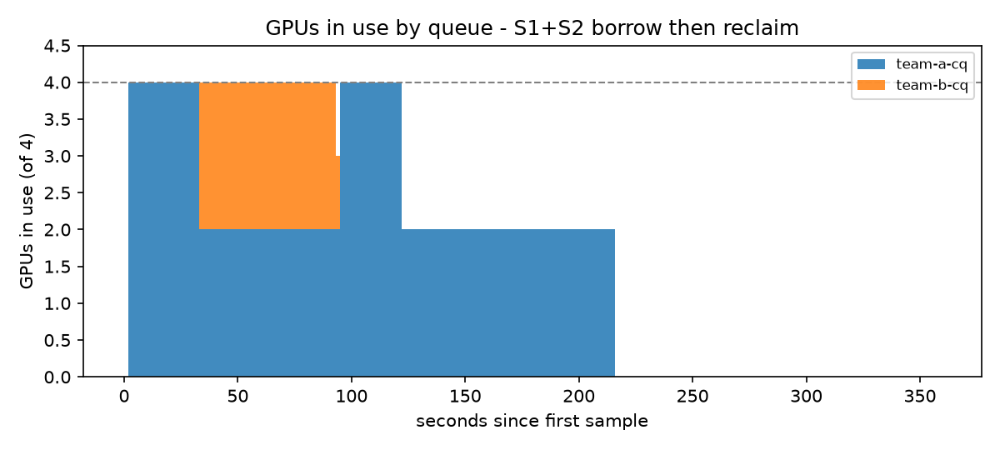

# 시뮬레이션 실험 결과 (2026-10-01)

환경: KWOK v0.8.0 가짜 노드 2대(GPU 2개씩, 총 4개) + 실제 kube-apiserver/scheduler v1.36.1 + 실제 Kueue v0.20.0 컨트롤러.
작업 실행만 시뮬레이션이고, 어떤 작업을 언제 받아 주고 누구를 선점할지는 실제 Kueue가 판단했습니다.
재현: `sim/up.sh` → `sim/run-all.sh`. 작업 길이는 S1/S4 120초, S2 60초, S3 90초(high 30초).

## 핵심 숫자: 빌려 쓰기(cohort) vs 엄격한 할당량

같은 조건(team-a가 GPU 1개짜리 작업 4개 제출, team-b는 쉬는 중)

| 지표 | cohort 있음 (S1) | cohort 없음 (S4) |
|---|---|---|
| 작업 4개 모두 끝난 시간 | **121초** | 243초 |
| 평균 대기시간 | **0초** | 61초 |
| 최대 대기시간 | 0초 | 122초 |
| 평균 GPU 사용률 (끝날 때까지) | **98%** | 50% |

→ 쉬는 팀의 GPU를 빌려 쓰게 하자 완료 시간이 **절반(243초 → 121초)**, GPU 사용률이 **50% → 98%**가 됐습니다.

## S2. 주인이 돌아오면 되찾기

team-a가 GPU 4개(2개는 빌린 것)를 쓰는 중에 team-b가 작업 2개를 제출.

| | 결과 |
|---|---|
| team-b 대기시간 | **1초, 2초** |
| team-a | 빌린 GPU로 돌던 2개가 선점(evicted) → 다시 대기열로 → 93~94초 뒤 재실행 |
| 전체 완료 | 215초 |

관찰: 선점된 작업은 처음부터 다시 돌아서(각 120초) 약 30초씩 한 일이 버려졌습니다. 실제 학습이라면 **체크포인트 저장/재개**가 필요하다는 근거입니다.

## S3. 우선순위 선점

team-a, team-b가 각자 GPU 2개를 다 쓰는 상태에서 team-a에 high 작업 1개 제출.

| | 결과 |
|---|---|
| high 작업 대기시간 | **1초** |
| team-a low 작업 | 1개 선점 → high가 끝난 뒤 48초 시점에 재실행 |
| team-b | 영향 없음 (선점 0건) |

## 원본 증거

각 폴더에 `workloads.json`(Kueue Workload 원본), `report.md/csv`, `events.txt`, `clusterqueues.txt`, `gpu-usage.csv`.
S1+S2 폴더의 `at-30s-before-team-b.txt` / `at-40s-after-team-b.txt`가 선점 직전/직후 스냅샷입니다.

## 한계

- GPU 연산은 시뮬레이션입니다. 실제 GPU 성능·time-slicing 효과는 [docs/real-gpu.md](../../docs/real-gpu.md) 단계에서 따로 측정해야 합니다.
- 노드 2대, 팀 2개의 작은 규모입니다.
